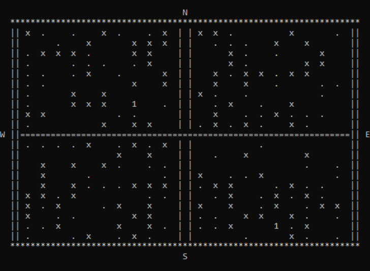
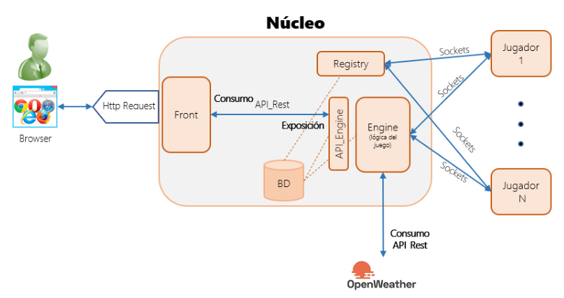
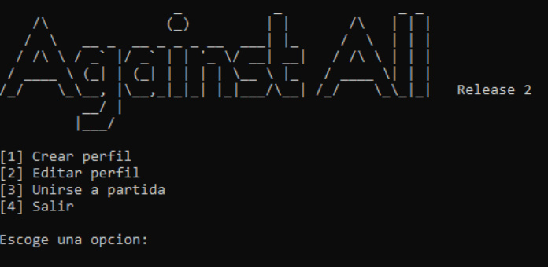
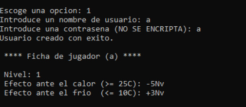
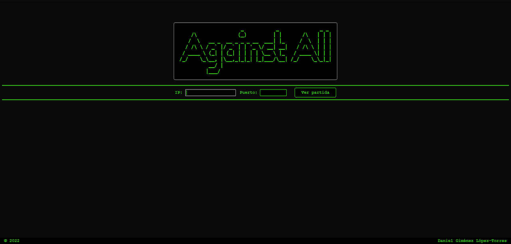
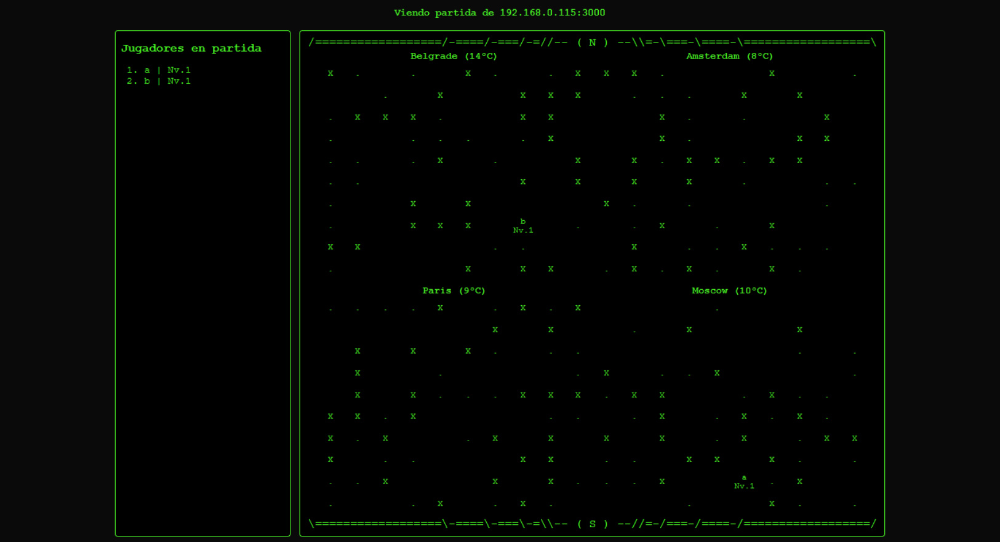

# Against All

*Against All* es un **juego multijugador online de terminal** que enfrenta a un número de jugadores en un **todos contra todos** hasta que sólo queda uno.



Está desarrollado en **Java** y utiliza ***sockets*** para la comunicación entre sus elementos.

Las partidas se disputan en una **matriz 20x20**. La matriz se divide en **4 zonas**, y a cada una se le asigna una **ciudad** del mundo y su **temperatura real en el momento**, obtenida de forma dinámica haciendo peticiones a la API de [**OpenWeatherMap**](https://openweathermap.org/). Cada casilla puede contener:
- Un **jugador**, representado por su **nivel**. La **temperatura** de la zona en la que se encuentra afecta de distinta forma al **nivel** de cada jugador.
- Un **potenciador** que *sube un nivel*, representado por un **punto** (```.```).
- Una **mina** que *elimina instantáneamente* al jugador, representado por una **equis** (```X```).
- Un **espacio vacío**.

Durante la partida, los jugadores pueden desplazarse **de casilla en casilla** en cualquier dirección y en **tiempo real**. Si dos jugadores **colisionan**, el de menor nivel se **eliminará** de la partida. Los datos de la partida se van **almacenando periódicamente** en ficheros.

Incluye un **API REST** que sirve los datos de la partida, así como un ***front end*** que permite monitorizarla desde el navegador.

## Componentes

El juego se compone de los siguientes archivos:



- **Componentes principales** (requiren *Java Runtime Environment*).
  - **Servidor**.
    - **```AA_Nucleo_Engine.jar```**. Contiene la **lógica fundamental** del juego y gestiona cualquier tarea relacionada directamente con la partida (crear y enviar el mapa a los jugadores, almacenarlo periódicamente, recibir comandos, obtener las temperaturas, almacenar el mapa, etc).
    
      Cuando un cliente se conecta, crea un **hilo** para atenderlo individualmente, de modo que cada uno puede recibir el mapa de la partida y controlar a su avatar de forma individual.

    - **```AA_Nucleo_Registry.jar```**. Se encarga de gestionar la **creación de perfiles** para identificar a los jugadores en la partida. Atiende peticiones del mismo modo que el anterior.
    
    - **API REST**.
      - **```API_Engine.js```**. API simple que pone a disposición de cualquier cliente información de diversa índole sobre la partida (mapa, jugadores, ciudades, etc), e incluso si está en curso. Se abre en el puerto 3000.

        **Requiere *Node.js***.
    - **Ficheros** (```ciudades.txt```, ```mapa.txt```, etc). Almacenan información sobre la partida, los jugadores y las ciudades tanto disponibles como elegidas para una partida concreta.
    
  - **Cliente**.
    - **```AA_Player.jar```**. Permite acceder a una partida y jugar conectándose a un servidor de juego.

- ***Front end***. Una pequeña página por separado con un fichero HTML, CSS y JavaScript que permite **espectar** una partida, suponiendo que se conoce la IP y puerto de la API.

## Puesta en marcha

Se puede ejecutar todas las partes del juego en una sola máquina, pero, a efectos de mostrar sus capacidades online, en esta sección se explica cómo ejecutar las distintas partes del juego (servidor, cliente y *front end*) en 4 máquinas diferentes.

1. Ejecutar **```AA_Nucleo_Engine.jar```**, **```AA_Nucleo_Registry.jar```** y **```API_Engine.js```** en la **máquina 2**.

   - ```java -jar AA_Nucleo_Engine.jar [PUERTO] [MÁX. JUGADORES]```
   - ```java -jar AA_Nucleo_Registry.jar [PUERTO]```
   - ```node API_Engine.js```


2. Ejecutar **```AA_Player.jar```** en las **máquinas 3 y 4 ... N**.

   - ```java -jar AA_Player.jar [IP ENGINE] [PUERTO ENGINE] [IP REGISTRY] [PUERTO REGISTRY]```



3. Crear un **perfil** por jugador.



4. Acceder a la partida con las credenciales.


Los jugadores pueden desplazarse libremente por el mapa **introduciendo un número** del 1 al 9 y confirmando con **Intro**. Se desplazarán **una casilla en la dirección que ocupe el número en el teclado numérico**.

5. Abrir el ***front end*** en la **máquina 1**.



6. Introducir la IP y el puerto del **API REST** de la **máquina 2**.

